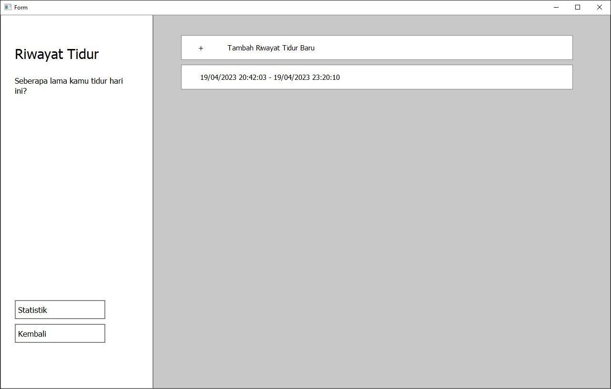
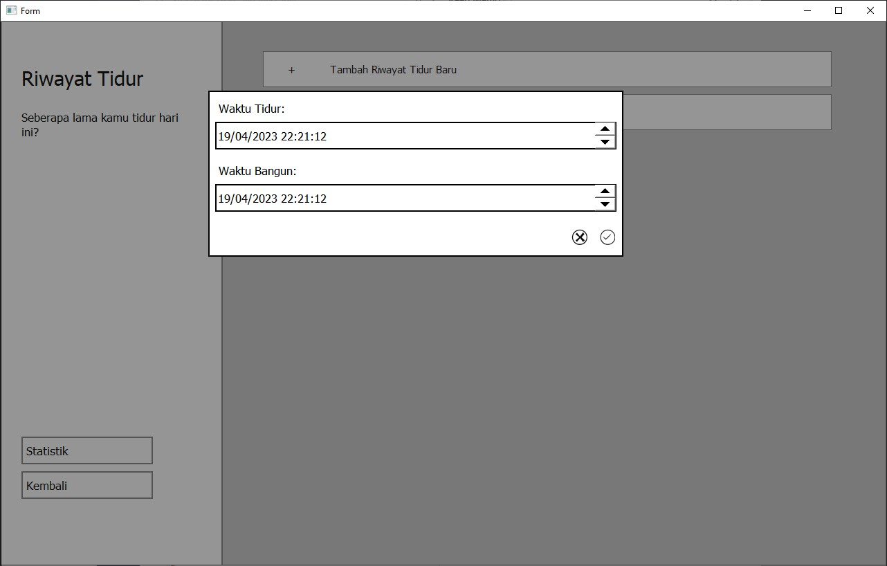

# EmoTrack

<details>
  <summary>Daftar Isi</summary>
  <ol>
    <li>
      <a href="#deskripsi">Deskripsi</a>
    </li>
    <li>
      <a href="#penggunaan">Penggunaan</a>
      <ul>
        <li><a href="#prasyarat">Prasyarat</a></li>
        <li><a href="#menjalankan-program">Menjalankan Program</a></li>
      </ul>
    </li>
    <li>
        <a href="#daftar-modul">Daftar Modul</a>
        <ul>
            <li><a href="#mood">Mood</a></li>
            <li><a href="#quote">Quote</a></li>
            <li><a href="#jurnal">Jurnal</a></li>
            <li><a href="#riwayat-tidur">Riwayat Tidur</a></li>
            <li><a href="#home">Home</a></li>
        </ul>
    </li>
    <li>
        <a href="#tabel-basis-data">Tabel Basis Data</a>
        <ul>
            <li><a href="#tabel-mood">Mood</a></li>
            <li><a href="#tabel-jurnal">Jurnal</a></li>
            <li><a href="#tabel-quotes">Quote</a></li>
            <li><a href="#tabel-sleep">Sleep</a></li>
            <li><a href="#home">Home</a></li>
        </ul>
    </li>
    <li><a href="#anggota-kelompok">Anggota Kelompok</a></li>
  </ol>
</details>

## Deskripsi
EmoTrack merupakan aplikasi pencatat perasaan pada desktop. Fitur yang dimiliki EmoTrack:
- Mencatat perasaan, riwayat tidur, dan jurnal harian
- Menampilkan analisis grafik pada data yang tersimpan
- Menampilkan kutipan favorit pengguna

## Penggunaan
### Prasyarat
- `python3` minimal versi v3.10
    - cek versi python3 dengan `python --version` atau `py3 --version`
- `PyQt5` library
    - Disarankan menggunakan versi terbaru. Install atau update dengan menjalankan
        ```
        pip install -U PyQt5
        ```

### Menjalankan Program
- clone repository ini dengan menjalankan
    ```bash
    git clone git@gitlab.informatika.org:Michaelu/if2250-2023-k01-3-emotrack.git
    ```
- buka command prompt dari root dan jalankan
    ```
    python src/main.py
    ```

## Daftar Modul
### Mood
Penanggung Jawab: [Brian Kheng](#anggota-kelompok) \
File terkait:
- [Mood.py](src/Mood.py)
- [MoodController.py](src/MoodController.py)
- [MoodUserInterface.py](src/MoodUserInterface.py)

Tampilan layar:
- Tanpa data

- Dengan data


### Quote
Penanggung Jawab: [Muhamad Aji Wibisono](#anggota-kelompok) \
File terkait:
- [Quote.py](src/Quote.py)
- [QuoteController.py](src/QuoteController.py)
- [QuotesUserInterface.py](src/QuotesUserInterface.py)

Tampilan layar:
- Daftar quote (kutipan)

- Lihat dan edit quote

- Tambah quote


### Jurnal
Penanggung Jawab: [Michael Utama](#anggota-kelompok) \
File terkait:
- [Jurnal.py](src/Jurnal.py)
- [JurnalController.py](src/JurnalController.py)
- [JurnalUserInterface.py](src/JurnalUserInterface.py)
- [StatisticWithLabel.py](src/StatisticWithLabel.py)

Tampilan layar:
- Daftar jurnal

- Tulis jurnal harian

- Statistik frekuensi jurnal


### Riwayat Tidur
Penanggung Jawab: [Dewana Gustavus Haraka Otang](#anggota-kelompok) \
File terkait:
- [Sleep.py](src/Sleep.py)
- [SleepController.py](src/SleepController.py)
- [SleepUserInterface.py](src/SleepUserInterface.py)

Tampilan layar:
- Daftar riwayat tidur

- Input jadwal tidur

- Statistik tidur


### Home
Penanggung Jawab: [Muhamad Aji Wibisono](#anggota-kelompok) \
File terkait:
- [UserInterface.py](src/UserInterface.py)
- [HomeUserInterface.py](src/HomeUserInterface.py)
- [custom.py](src/custom.py)

Tampilan layar:
- Tampilan layar utama

- Ubah nama pengguna


## Tabel Basis Data
### Tabel Mood
| id | description | type | details |
|---|---|---|---|
|id|id mood|INTEGER|PRIMARY KEY, AUTOINCREMENT|
|mood|deskripsi mood|TEXT|-|
|date|tanggal mood|DATE|-|

### Tabel Jurnal
| id | description | type | details |
|---|---|---|---|
|id|id jurnal|INTEGER|PRIMARY KEY, AUTOINCREMENT|
|judul|judul jurnal|VARCHAR(255)|NOT NULL|
|isi|isi jurnal|MEDIUMTEXT|-|
|waktuEdit|waktu edit jurnal|DATETIME|-|

### Tabel Quotes
| id | description | type | details |
|---|---|---|---|
|id|id quotes|INTEGER|PRIMARY KEY, AUTOINCREMENT|
|quote|isi quote|TEXT|-|
|date|tanggal edit quote|TEXT|-|

### Tabel Sleep
| id | description | type | details |
|---|---|---|---|
|id|id sleep|INTEGER|PRIMARY KEY, AUTOINCREMENT|
|waktu_tidur|waktu mulai tidur|DATETIME|-|
|waktu_bangun|waktu bangun|DATETIME|-|
|waktu_edit|waktu edit data|DATETIME|-|

## Anggota Kelompok
- 13521049 [Brian Kheng](https://gitlab.informatika.org/briankheng)
- 13521095 [Muhamad Aji Wibisono](https://gitlab.informatika.org/MuhamadAjiW)
- 13521137 [Michael Utama](https://gitlab.informatika.org/Michaelu)
- 13521173 [Dewana Gustavus Haraka Otang](https://gitlab.informatika.org/DewanaGustavus)
